# Capstone_Project
Predicting NBA Player Salaries using a Neural Network

## Introduction

Each year, barring a lockout, the NBA hosts a draft whereby incoming rookies are drafted into the league by various teams under 4-year contracts, of which the 3rd and 4th years are team options. As a result, an NBA General Manager (GM) must often make a determination after year 3 to either extend, release, or trade said player.

The aim of this project is to build a Fully Connected Neural Network using NBA Player Statistics and Advanced Statistics, and salary data - collected from [Basketball Reference](https://www.basketball-reference.com/). The goal of my study was to predict future players statistics and salaries given their current statistics and salaries. For this task, there are two approaches to follow, one, I can train a time series prediction model that predicts future statistics for any number of future time steps, or I design a model that given the features for any time point ‘t’, predicts the same feature values for time point ‘t’+1. In the second approach, I can call the trained model multiple times in a row, by providing it the predicted values from the previous time point in order to predict the values for the following time point. That way, I can predict the statistics and salaries for any number of time steps. To analyse different model architectures, I came up with a wide model with some internal layers having many neurons, a short model with each layer having a few neurons (e.g. 20), another model with the number of neurons in each layer less than the wide model but more than the short one (henceforth, the hybrid model) and two deep architectures with several internal layers. I evaluated the performance of each model on a test set, and found the hybrid model produced the best prediction loss results.

For this project, I defined the target cohort as follows: players whose last active season was 2018, and whose 2018 season was their 3rd or 4th season. For this cohort, 86 players, the model predicted their next 7 seasons of annual salaries. Last, I created a dashboard to display the attributes of the target player and their 5 year salary value which could be used as a comparison metric against real-world contract values.

      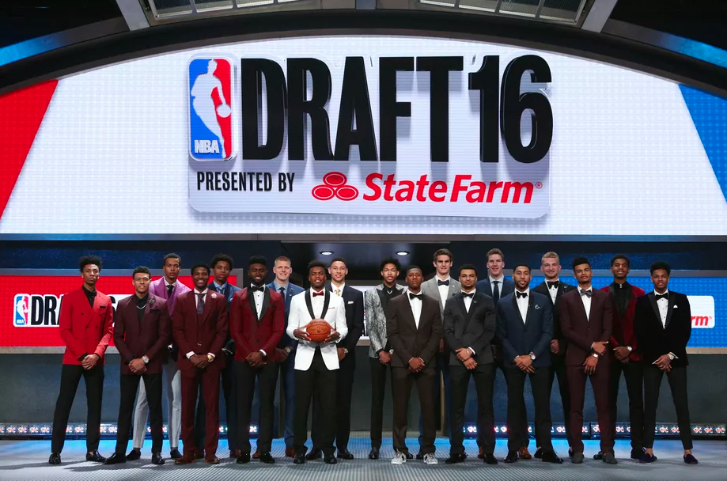

## Overview

For reference, here's a list of relevant files and links:

   * [Capstone Notebook](https://github.com/utaveras/Capstone_Project/Capstone_NN_SalaryPredictionModel_UT.ipynb): includes all related data modeling code as well as the final model.
   * [Dashboard Notebook](https://github.com/utaveras/Capstone_Project/Capstone_Dashboard_UT.ipynb): includes  dashboard & visualization code used for exploring the results.
   * [Data Scrape & Wrangling Notebook](https://github.com/utaveras/Capstone_Project/Capstone_DataScrapeWrangling_UT.ipynb): includes the code used for sourcing and prepping the data.
   * [Glossary of NBA Stats](https://www.basketball-reference.com/about/glossary.html): definitions for attributes used as features in the final model.

## Methodology

### Data Prepration
I began by scraping [Basketball Reference](https://www.basketball-reference.com/) for all Player Stats using the [PandasBasketball](https://pypi.org/project/PandasBasketball/) Python package. For Salary Data, I used the [NBA Salaries](https://data.world/datadavis/nba-salaries) CSV file which contained the salary data of NBA Players from 1985 to 2018. For 2019, I manually scraped [2018 - 2019 NBA Player Contracts]() page on Basketball Reference using the 10/22/2018 (NBA Opening Day) historic snapshot found on [WayBack Machine](https://web.archive.org/web/20181022200817/https://www.basketball-reference.com/contracts/players.html). Once imported, I combined the multiple DataFrames of Player Stats and removed any features (columns) which were unnecessary, leaving only the raw, un-processed data. Then, I normalized each feature across the players to avoid over-fitting as much as possible. Finally, the normalized data was split into a train and test set of 75%-25% proportions.

### Model Design
After prepping and normalizing the dataset, I began experimenting with a number of model architectures, all of which were built using fully connected layers of different sizes and different depths. As such, I created a Short Model, a Wide Model, a Deep Model, and another Deep model based on the Unet network. The architecture of each of these models is listed shortly below. In a sense, the architecture of the models mimic those of sparse auto-encoders, with the difference being that while the outputs are the same to the inputs naturewise, they are not supposed to be exactly the same. However, the principles remain the same, that is, I want to learn a latent space where the input information (i.e. statistics and salary) can be represented in that latent space, from which I can predict the same variables but for the next time step.

#### The Architecture of the Designed Models
The models have 18 input features and predict the same number of features in the output. I use the average of the mean squared error (avg MSE) as the loss function. To adjust the weights, I used the ADAM optimizer, which has been successfully tested in many previous deep neural models.

#### <i>Short Model</i>
The first model evaluated was a Short Model. I call it short, because the number of neurons in each layer are limited (i.e. <=30). The architecture of this model is as follows:
* Total number of Model layers = 4
  1. Dense Layer = 20 neurons
  2. Dense Layer = 25 neurons
  3. Dense Layer = 30 neurons
  4. Dense Layer = 18 neurons

#### <i>Wide Model</i>
The next model evaluated was a Wide Model (i.e. layers have many more neurons, compared to the short model), with the following architecture:
* Total number of Model layers = 4
  1. Dense Layer = 32 neurons
  2. Dense Layer = 64 neurons
  3. Dense Layer = 256 neurons
  4. Dense Layer = 18 neurons

Note that a high number of neurons would mean a higher capacity and a higher chance of over-fitting. For example, in case of the wide model, the third inner layer in the short model has 25\*30 = 750 neurons, while the same layer in the wide model has 256\*64=16384 weights, which is 22 times bigger and hence there is a higher likelihood for over-fitting, in the latter model.

#### <i>Deep Model</i>
Deep models have recently been of the focus of attention because of their state-of-the-art performances. Such models while often have many fewer weights to train, compared to the wide ones, they are often much deeper and hence allow modeling of more non-linear and complex relations. Thus, I designed two deep models and trained them on the data.
* Total number of Model layers = 11
  1. Dense Layer = 32 neurons
  2. Dense Layer = 128 neurons
  3. Dense Layer = 512 neurons
  4. Dense Layer = 600 neurons
  5. Dense Layer = 700 neurons
  6. Dense Layer = 800 neurons
  7. Dense Layer = 1000 neurons
  8. Dense Layer = 700 neurons
  9. Dense Layer = 400 neurons
  10. Dense Layer = 100 neurons
  11. Dense Layer = 18 neurons

#### <i>Unet Based Deep Model</i>
The next model tested was a Unet Based Deep Model with the following architecture:
* Total number of Model layers = 11
  1. Dense Layer = 64 neurons
  2. Dense Layer = 128 neurons
  3. Dense Layer = 256 neurons
  4. Dense Layer = 512 neurons
  5. Dense Layer = 1024 neurons
  6. Dense Layer = 512 neurons
  7. Dense Layer = 256 neurons
  8. Dense Layer = 128 neurons
  9. Dense Layer = 64 neurons
  10. Dense Layer = 32 neurons
  11. Dense Layer = 18 neurons

Since the problem I'm solving is a new problem with a self-generated dataset,  there wasn't a benchmark model available for comparison’ sake. Thus I set out to test the models using different approaches and configurations to see which produced the lowest MSE loss while accounting for over-fitting by monitoring the test loss values.

Here are the Loss Results for the 4 models:

    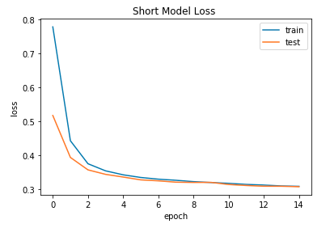  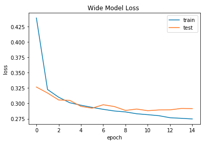

    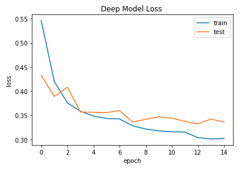  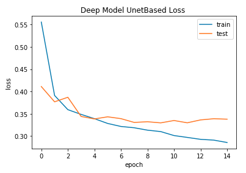

I show the learning curves for the previously mentioned models above. Based on these figures, the Short Model and Wide Model appeared to show the most promise. Thus I did a full training on both models to test their performance. The short model converges the fastest, which is because of the smaller number of parameters to train. Also, the same model shows the least variance (i.e. smallest gap between the training loss and the test loss), which is the preferred behaviour. The wide model appears to overfit the data when the training reaches 10 epochs, which suggests that I should stop the training there. The figures can confirm this below.

    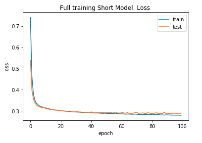  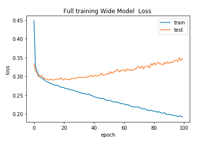

In another experiment, I trained the short and the wide models for a longer time to see the effect of over-fitting due to over training. As you can see from the images above, the Short Model is underfitting the data, and hence, no matter how many epochs I train, no gap is witnessed between the training/test loss trajectories, whereas, for the wide model, the over-fitting kicks in as soon as I train for over 12 epochs. That suggests that the optimal model, in terms of the complexity, is something in between. Thus I designed another model, henceforth the hybrid model, that is more complex than the underfit model, but less complex than the overfit one. I present the architecture of such a model below.

#### <i>Final Hybrid (Short/Wide) Model</i>
The last model tested was a Hybrid Model, informed by the previous Short & Wide Models, with the following architecture:
* Total number of Model layers = 7
  1. Dense Layer of 30 neurons with an Elastic ReLU activation
  3. Dense Layer = 40 neurons with ...
  5. Dense Layer = 50 neurons with ...
  7. Dense Layer = 18 neurons

    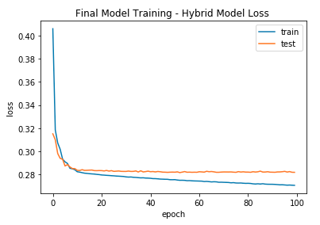

The image above shows the learning curve of the hybrid model. Interestingly, while the performance increased, I also observed a reduction in the over-fitting level.

## Results

Thus the best model tested, the Hybrid Model, produced an MSE loss of 0.273 on the Train Dataset and an MSE loss of 0.288 on the Test Dataset.

To help illustrate the impact of these results, I'll be looking at the results of 5 players to see how the model performed versus their actual salaries.

<b><u>Norman Powell</u>:</b>

    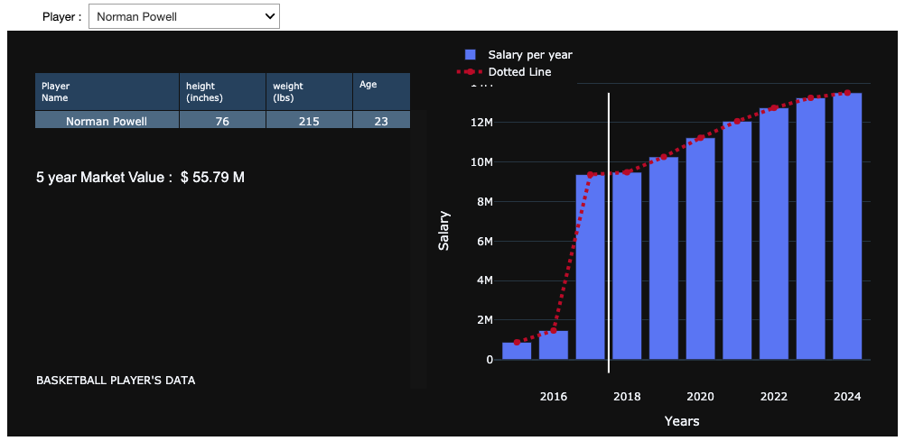  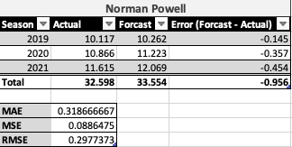

Norman Powell was the 46th overall pick in the 2015 NBA Draft by the Milwaukee Bucks. However, on June 25th, 2015, he was traded to the Toronto Raptors. As you can see from the  images above, the model could predict his annual salaries fairly accurately with an average delta of around $300 thousand per year. Powell's projections suggest he's a player worthy of an extension which is precisely what the Raptors did on October 8th, 2017 when he signed a 4 year contract extension worth $42 million. For reference, Powell's projections when compared to his actual salary values had an MAE = 0.319 and an RMSE = 0.298.

<b><u>Jake Layman</u>:</b>

    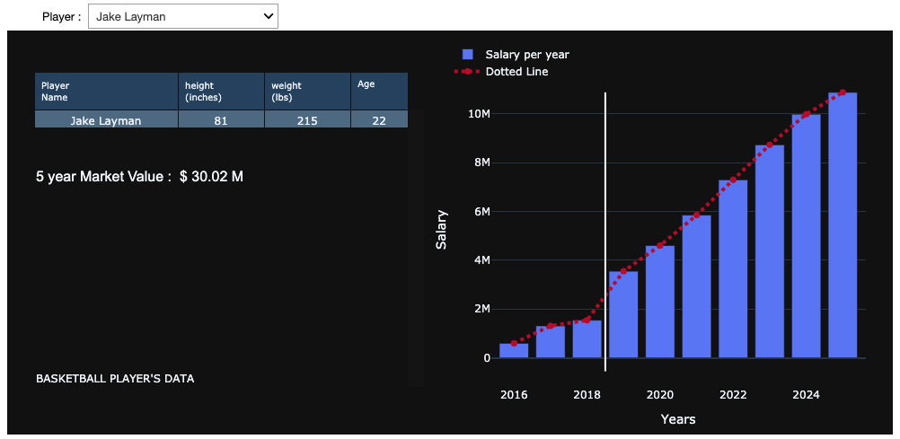  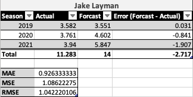

Jake Layman was the 47th overall pick in the 2016 NBA Draft by the Orlando Magic and traded the next day to the Portland Trail Blazers.  As you can see from the images above, the model could predict Layman's annual salaries somewhat accurately with an average delta of $1 million per year. Layman's projections suggest he's a developmental player worth keeping or trading for another asset.  The Trail Blazers decided to trade him to the Minnesota Timberwolves via a sign-and-trade on July 8th, 2019. For reference, Layman's projections when compared to his actual salary values had an MAE = 0.926 and an RMSE = 1.042.

<b><u>Karl-Anthony Towns</u>:</b>

    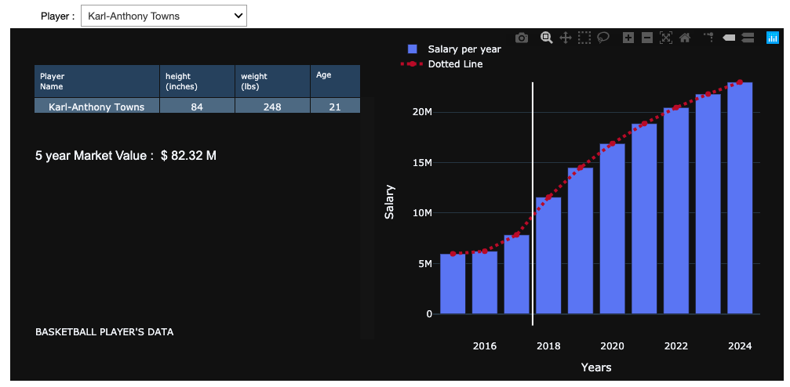  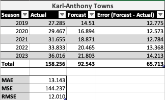

Karl-Anthony Towns was the \#1 overall pick in the 2015 NBA Draft.  As you can see from the images above, the model wasn't able to predict his annual salaries accurately, resulting in a forecast with an average delta of $13 million per year. However, when looking at the results directionally, you can see that KAT is a player worth a contract extension since his predicted salary is greater than 4 times his previous salary. For reference, MAE = 13.143 and RMSE = 12.010.

<b><u>Tyus Jones</u>:</b>

    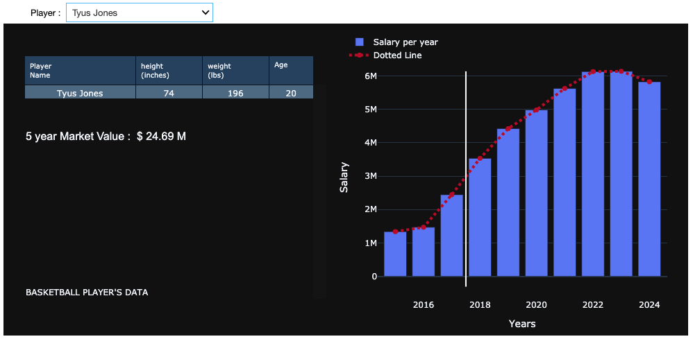  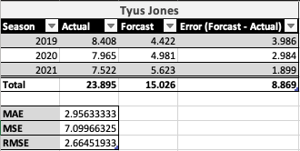

The Cleveland Cavaliers selected Tyus Jones with the 24th overall pick in the 2015 draft who then traded his draft rights to the Minnesota Timberwolves. The model wasn't accurate in predicting this player's salary, however it was arguably in the ballpark. Again, if I look at the visual above, I can see a 2x-3x salary increase in the forecasted value. Thus signaling a player who's worth keeping if the circumstances permit. Which, for the Timberwolves, they did not. Tyus Jones, as a restricted free agent, signed the offer sheet the Memphis Grizzlies extended and which the Timberwolves declined to match. Jones’ deal with Memphis is for three years and worth up to $28 million, just over $9 million per year, when factoring in incentives which for the Timberwolves would've pushed them near the Luxury Tax should they have elected to match the offer.  Yet per the model, he's salary projection shows he's replaceable and could be one reason the Timberwolves ultimately decided not to match. For reference, MAE = 2.956 and RMSE = 2.665.

<b><u>Jaylen Brown</u>:</b>

    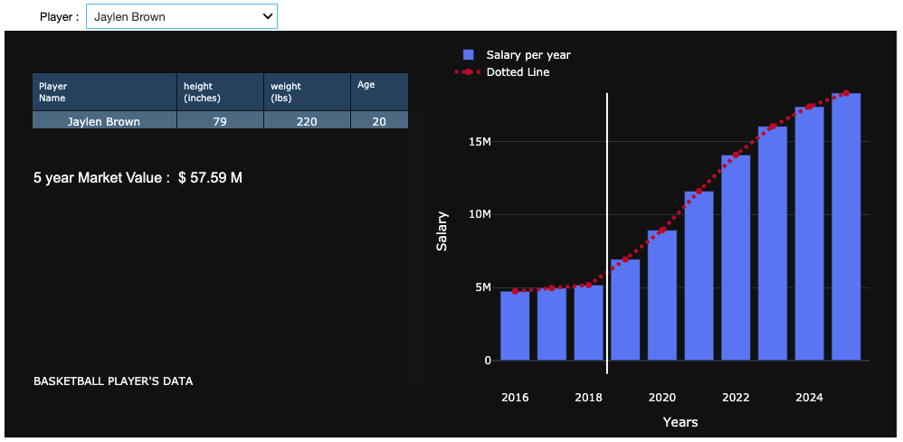  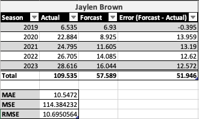

The Boston Celtics selected Jaylen Brown with the 3rd overall pick in the 2016 NBA Draft. Similar to the previous case of KAT, the model wasn't accurate in predicting his future salary, however it was directionally accurate.  In other words, the model predicted his future salary values above $14 million, around 3 times his previous salary, thus showing this player is a candidate for a contract extension. Which is precisely what Brown did in 2019, where he signed a 4 year - $107 million contract extension with the Boston Celtics, thus securing him through the 2023-2024 season. For reference, MAE = 10.547 and RMSE = 10.695.

<b><u>Pascal Siakam</u>:</b>

    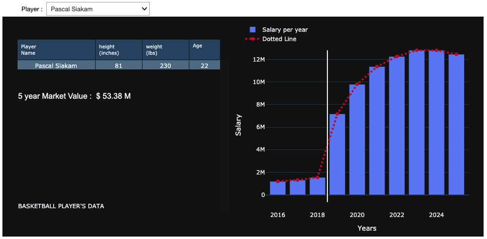  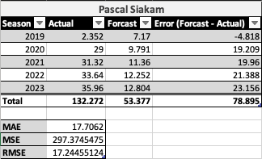

The Toronto Raptors selected Pascal Siakam with the 27th overall pick in the 2016 NBA Draft. On October 21, 2019 he signed a 4 year $130 million contract extension with the Raptors. The model wasn't accurate in predicting his future contract values, however the model showed a 5x+ increase from his rookie salary.  I can interpret this dramatic increase in salary as a buying signal, or in this case a signal to extend the target player. Which is precisely what the Raptors did on October 21st, 2019. For reference, MAE = 17.706 and RMSE = 17.244.

## Conclusion

In short, it appears the model performed fairly well when considering the overall dataset. The model scored best when considering players whose performances were closer to the mean. Thus when the model projected salaries for players whose performances were outliers, i.e. further from the mean, the model's projections could not keep up with the salary increases. As illustrated in the following image:

    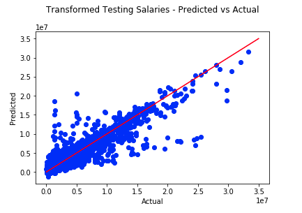

Judging from the image above, it seems the model has three subsections of performance. The first one is where Actuals have values between 0 and 1.0 (i.e. 0 to $10 million). Within this zone, the model seems to overestimate. The second one is when Actuals are between 1.0 and 2.0 (i.e. $10 - $20 million), here the model's performance doesn't seem to perform too badly. The third zone is for Actuals > 2.0 (i.e. > $20 million), in this zone the model consistently underestimates the Actual values.

First, I suspect part of this variance in salary estimations is because of the yearly Salary Cap increases, which occur annually at an average rate of 8.5% per year. Notably, the Salary Cap increased by 32.13% in 2016 to $91 million from a level of $69.13 million in 2015. Second, I suspect inflation may play a role as well since on average salaries have increased 43.37% since 1984 when compared to the value of the dollar in 2015.  Thus I've captured these two points below as items to explore in future iterations.

My findings suggest that more external work is necessary to increase the accuracy of the salary predictions. Overall, the model appears to be helpful from a directional perspective.  One could infer whether a player is worth a contract extension by evaluating the predicted salaries versus their historic rookie salaries.  If the increase is substantial, ex. 2-3 times more, then one could infer a contract extension or trade.  Conversely, if the predicted values are less than the historic values, then releasing the player is a plausible outcome.  Last, if the predicted salary is in the relative ballpark of the historic rookie salaries then one could extend or release the player based on what's best for the team considering Luxury Tax implications, Team Salary Cap implications, and Free Agent alternatives.

## Next Steps

<b><u>Improve Model</u>:</b>
* Add Yearly NBA Salary Cap Data to model
  - Convert all salary values to their current year salary adjusted equivalent
* Add an Engineered Feature for each Players' Salary so it's represented as a Percentage of the Salary Cap
* Explore additional Advanced Stats and Features
* Normalize AFTER Test Train Split
* Use a separate validation set (instead of the test set) for selection of the right hyper-parameters, and then do a final evaluation of the selected model (according to the validation set performance) on the test set.
  - Or use cross validation to choose the right model.
* Enhance model complexity so it can take multiple historic time steps into its prediction for the next time step.
  - Currently, the model makes its prediction of the statistics and salary for a player, based solely on the data from the previous time step (t-1). In future iterations, the model can take into account several time steps in the past (i.e. t-1, t-2, t-3, etc...), to make more accurate predictions.
